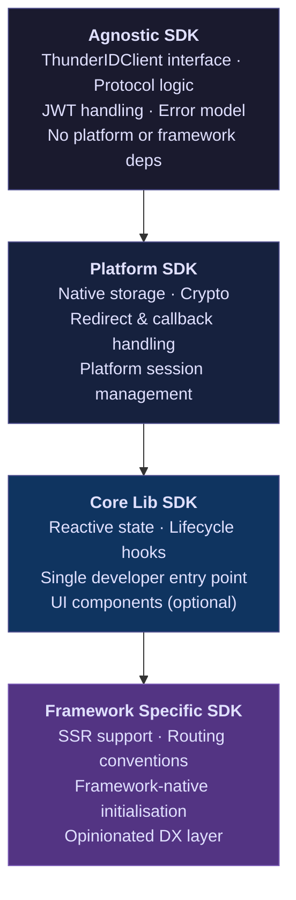
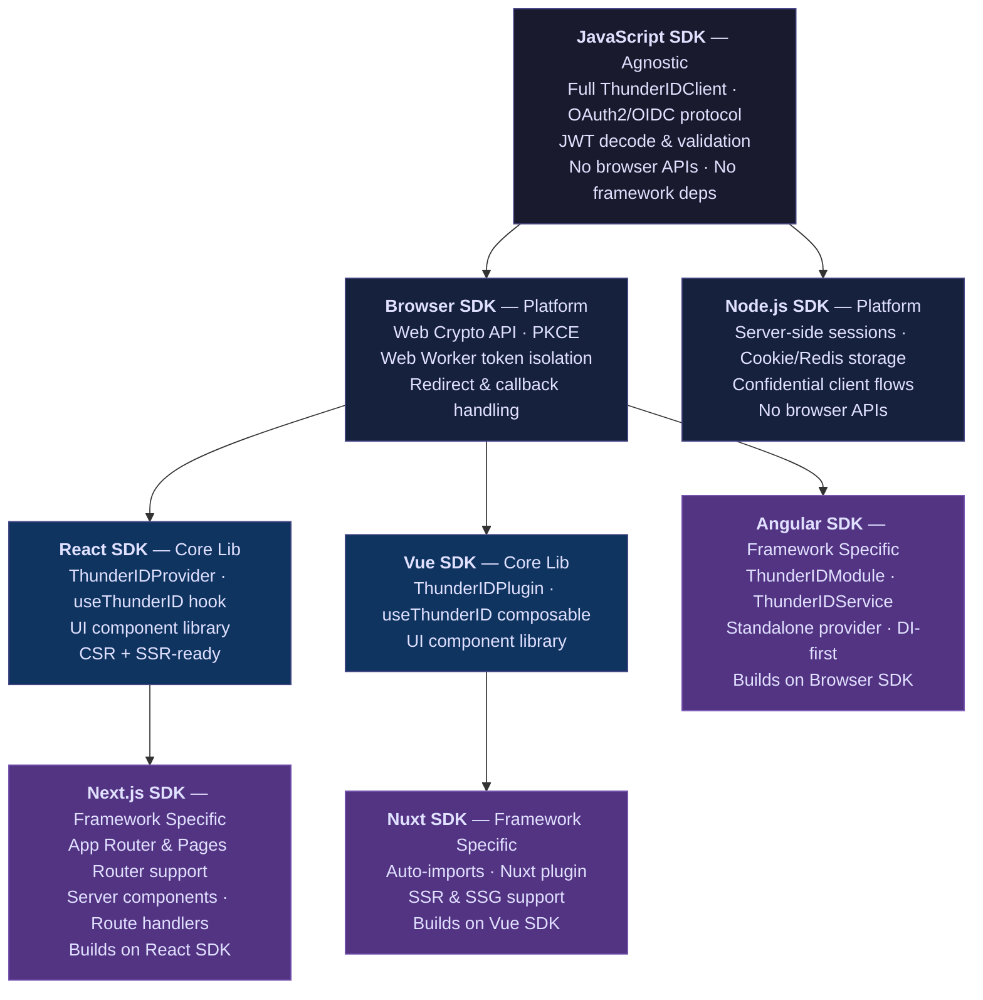

# ThunderID SDK Specification

**Version:** 1.0.0-draft
**Status:** Draft
**Last Updated:** 2026-03-08

---

## Table of Contents

1. [Introduction](#1-introduction)
2. [SDK Architecture](#2-sdk-architecture)
   - 2.1 [Overview](#21-overview)
   - 2.2 [The Four Layers](#22-the-four-layers)
   - 2.3 [General Architecture Diagram](#23-general-architecture-diagram)
   - 2.4 [Worked Example — JavaScript Ecosystem](#24-worked-example--javascript-ecosystem)
   - 2.5 [Applying the Pattern to Other Ecosystems](#25-applying-the-pattern-to-other-ecosystems)
   - 2.6 [Layer Rules](#26-layer-rules)
   - 2.7 [Integration Packages](#27-integration-packages)
3. [Guiding Principles](#3-guiding-principles)
4. [Operational Modes](#4-operational-modes)
5. [SDK Initialization & Configuration](#5-sdk-initialization--configuration)
   - 5.1 [Initialization](#51-initialization)
   - 5.2 [Configuration Reference](#52-configuration-reference)
   - 5.3 [Preferences](#53-preferences)
6. [Identity Lifecycle Operations](#6-identity-lifecycle-operations)
   - 6.1 [Authentication (Sign-In)](#61-authentication-sign-in)
   - 6.2 [Registration (Sign-Up)](#62-registration-sign-up)
   - 6.3 [Account Recovery](#63-account-recovery)
   - 6.4 [Session Management](#64-session-management)
   - 6.5 [Token Management](#65-token-management)
   - 6.6 [User Profile Management](#66-user-profile-management)
   - 6.7 [Organization Management](#67-organization-management)
7. [Framework Integration](#7-framework-integration)
   - 7.1 [Client Interface](#71-client-interface)
   - 7.2 [Initialization Patterns](#72-initialization-patterns)
   - 7.3 [Exposed API Patterns](#73-exposed-api-patterns)
8. [UI Components](#8-ui-components)
   - 8.1 [Component-Driven IAM](#81-component-driven-iam)
   - 8.2 [Component Categories](#82-component-categories)
   - 8.3 [Component Architecture](#83-component-architecture)
   - 8.4 [Component Reference](#84-component-reference)
9. [API Design & Method Signatures](#9-api-design--method-signatures)
10. [Error Handling](#10-error-handling)
11. [Security Requirements](#11-security-requirements)
12. [Platform & Language Guidelines](#12-platform--language-guidelines)
13. [Extensibility & Customization](#13-extensibility--customization)
14. [Compliance & Standards](#14-compliance--standards)
15. [SDK Layout](#15-sdk-layout)
    - 15.5 [Integration List](#155-integration-list)
16. [Documentation Requirements](#16-documentation-requirements)
17. [Sample Applications](#17-sample-applications)
18. [Glossary](#18-glossary)

---

## 1. Introduction

This document defines the functional requirements and design principles for the ThunderID SDK suite.

The goal of the SDKs is to provide a consistent, secure, and developer-friendly way for applications to integrate with ThunderID across multiple environments and programming languages.

This specification defines the expected behavior of ThunderID SDKs, including supported identity lifecycle operations, authentication mechanisms, operational modes, API design conventions, error handling strategies, and security requirements.

It serves as a reference for:
- **SDK implementors** building ThunderID SDKs for any language or platform
- **Application developers** integrating SDKs into their products
- **Third-party contributors** extending or auditing SDK behavior

> **Note to implementors:** This specification is intentionally language-agnostic. Method signatures are expressed in pseudocode. Platform-specific implementation guides are maintained separately per language/runtime.

---

## 2. SDK Architecture

### 2.1 Overview

The ThunderID SDK suite is organised into four distinct layers. Each layer builds on the one below it, inheriting its contracts and extending them with platform or framework-specific capabilities. **No layer may skip its immediate parent**. If a framework SDK can be built on top of a Platform SDK or Core Lib SDK, it must use that layer instead of directly inheriting from the Agnostic SDK.

This layering ensures:
- Protocol logic (OAuth2/OIDC, token management, flow orchestration) is implemented once and shared across all higher layers
- Each layer has a strictly scoped responsibility and cannot bleed concerns upward or downward
- A security patch or bug fix in a lower layer propagates automatically to every SDK above it

---

### 2.2 The Four Layers

| Layer | Responsibility | Has UI | Example |
|-------|---------------|--------|---------|
| **Agnostic SDK** | Language-specific implementation of the full `ThunderIDClient` interface and all protocol logic. No platform, browser, or framework dependencies. | No | JavaScript SDK, Swift SDK, Python SDK |
| **Platform SDK** | Extends the Agnostic SDK with platform-specific capabilities: native storage, redirect/callback handling, platform crypto, and platform-native session management. | No | Browser SDK, Node.js SDK, iOS SDK, Android SDK |
| **Core Lib SDK** | Extends the Platform SDK with a framework's reactive primitives (state, lifecycle, context). Provides the single developer-facing entry point. UI components are optional at this layer. | Optional | React SDK, Vue SDK |
| **Framework Specific SDK** | Thin integration layer for opinionated full-stack or meta-frameworks. Adds SSR support, file-based routing conventions, and framework-specific initialisation helpers. Builds on a Core Lib SDK. | Optional | Next.js SDK, Nuxt SDK, Angular SDK |

---

### 2.3 General Architecture Diagram



---

### 2.4 Worked Example — JavaScript Ecosystem

The JavaScript ecosystem demonstrates all four layers concretely. The same pattern applies to any other language ecosystem.



> **Note on Angular:** Angular's strong dependency injection model means it integrates most naturally as a Framework Specific SDK directly on the Browser SDK, rather than on an intermediate Core Lib SDK. The same exception applies to any framework whose DI or module system makes an intermediate reactive layer redundant.

---

### 2.5 Applying the Pattern to Other Ecosystems

The same four-layer model applies to every supported ecosystem. Implementors MUST follow the layer definitions in Section 2.2 and document which layer each SDK occupies.

| Ecosystem | Agnostic | Platform | Core Lib | Framework Specific |
| --------- | -------- | -------- | -------- | ------------------ |
| **JavaScript** | JavaScript SDK | Browser SDK, Node.js SDK | React SDK, Vue SDK | Angular SDK, Express SDK, Next.js SDK, Nuxt SDK, React Router SDK, TanStack Router SDK |
| **Mobile — Apple** | Swift SDK | iOS SDK | SwiftUI SDK | — |
| **Mobile — Android** | Kotlin SDK | Android SDK | Jetpack Compose SDK | — |
| **Cross-platform Mobile (Dart)** | — | iOS SDK + Android SDK *(via platform channels)* | Flutter SDK (Dart) | — |
| **Cross-platform Mobile (JS)** | JavaScript SDK | iOS SDK + Android SDK *(via native modules)* | React Native SDK | — |
| **Python** | Python SDK | — *(server-side, no platform layer needed)* | Django / FastAPI SDK | — |
| **Go** | Go SDK | — *(server-side, no platform layer needed)* | — | — |

> **Flutter note:** Flutter does not have an Agnostic layer of its own. The Flutter SDK sits at the Core Lib layer and delegates all protocol operations to the iOS and Android Platform SDKs via platform channels. Flutter UI widgets are written in Dart on top of the bridged responses.
>
> **React Native note:** React Native follows the same cross-platform bridge pattern as Flutter. The React Native SDK sits at the Core Lib layer, uses the JavaScript SDK for protocol logic, and delegates platform-specific operations (secure storage, biometrics, redirect handling) to the iOS and Android Platform SDKs via native modules.

---

### 2.6 Layer Rules

The following rules MUST be observed by all SDK implementors:

- A layer MUST depend on exactly one parent layer (except where platform channels bridge two Platform SDKs, as in Flutter)
- A layer MUST NOT re-implement logic already present in its parent layer
- A layer MUST NOT expose internal implementation details of its parent layer through its own public API
- Each SDK MUST declare its minimum required version of its parent SDK as a versioned dependency
- A breaking change in any layer requires a **major version bump** in that layer and all layers that depend on it
- All SDK layers MUST document which version of this specification they implement

---

### 2.7 Integration Packages

Integration packages are distinct from SDKs. An **integration** adapts ThunderID authentication into an existing third-party auth framework or ecosystem tool that has its own auth abstraction layer. Integrations are not full ThunderIDClient implementations — they are thin adapters that delegate protocol operations to a ThunderID SDK.

**How integrations differ from SDKs:**

| Concern | SDK | Integration |
| ------- | --- | ----------- |
| Implements `ThunderIDClient` | Yes | No |
| Has a layer in the four-layer hierarchy | Yes | No — sits outside the hierarchy |
| Depends on | Its parent SDK layer | A ThunderID Platform or Core Lib SDK |
| Implements | ThunderID protocol logic | The target framework's provider/strategy/plugin interface |
| Lives under | `tools/sdks/` | `tools/integrations/` |
| Release tag | `sdk/<name>/v*` | `integration/<name>/v*` |

**When to build an integration instead of an SDK:**

Build an integration when the target ecosystem already has a well-established auth abstraction (e.g., Auth.js providers, Passport strategies, Backstage auth plugins) and developers expect to use ThunderID through that abstraction rather than the ThunderID SDK API directly.

**Integration contract:**

An integration MUST:

- Declare a versioned dependency on the ThunderID SDK it consumes (Platform or Core Lib layer)
- Implement the target framework's auth interface fully and correctly
- Not re-implement any OAuth2/OIDC logic — delegate all protocol operations to the ThunderID SDK
- Follow the target framework's own conventions for error handling, session management, and configuration
- Document which ThunderID SDK version and which target framework version it supports

---

## 3. Guiding Principles

All SDKs built under this specification MUST adhere to the following principles:

| Principle | Description |
|-----------|-------------|
| **Secure by Default** | All operations must apply security best practices without requiring developer configuration. Insecure options must be explicitly opted into. |
| **Mode Agnosticism** | The public API surface must remain identical regardless of the underlying operational mode (Redirect-Based or App-Native). |
| **Minimal Surface Area** | Expose only what is necessary. Internals must not leak implementation details. |
| **Fail Safely** | On error, the SDK must leave the application in a safe, defined state. Partial state must never be silently persisted. |
| **Extensibility** | The SDK must allow customization of flows, UI hooks, and token storage without requiring a fork. |
| **Observability** | The SDK must emit structured logs and events for diagnostics, without logging sensitive data. |
| **Consistency** | Method naming, error shapes, and event conventions must be uniform across all language implementations. |
| **Component-Driven IAM** | For UI-capable platforms, identity operations MUST be expressible as drop-in UI components (e.g., `<SignIn />`, `<SignedIn>`, `<UserProfile />`), not only as imperative API calls. Components must be composable, styleable, and not require custom wiring for standard flows. |
| **Simple Public API** | Regardless of internal complexity, the API surface exposed to application developers MUST be a single cohesive entry point per framework (e.g., one hook, one service, one provider). Internal sub-providers or helpers are implementation details and MUST NOT be required by application code. |

---

## 4. Operational Modes

SDKs MUST support two primary operational modes. The mode is set at initialization and applies globally to all operations.

---

### 4.1 Redirect-Based Mode (Standards-Based OAuth2/OIDC)

The SDK orchestrates authentication by redirecting the user to the ThunderID authorization endpoint and handling the callback response.

**When to use:**
- Web applications with a browser-based front-end
- Any scenario where the application can safely redirect and receive callbacks
- Scenarios requiring full standards compliance (OAuth 2.0, OIDC)

**Key characteristics:**
- Uses Authorization Code Flow with PKCE (mandatory)
- The SDK handles PKCE code verifier generation, storage, and exchange
- Redirect URIs must be pre-registered in the ThunderID console
- No credentials are handled by the application directly

**Flow overview:**

```
Application        SDK               ThunderID
    |               |                    |
    |--signIn()---->|                    |
    |               |--authorize (PKCE)->|
    |               |<--redirect+code----|
    |               |--token exchange--->|
    |               |<--tokens-----------|
    |<--AuthResult--|                    |
```

---

### 4.2 App-Native Mode (API-Driven)

The SDK communicates directly with ThunderID APIs, keeping the user within the native application experience throughout the entire flow. This is ThunderID's implementation for fully embedded authentication.

**When to use:**
- Native mobile applications (iOS, Android)
- Desktop applications
- Scenarios where browser redirects are undesirable or impossible

**Key characteristics:**
- Fully API-driven; no browser redirects
- The SDK manages multi-step authentication state internally
- Supports progressive step-up authentication (e.g., password → MFA)
- The SDK MUST NOT store plaintext credentials at any point
- Requires explicit enablement in ThunderID server configuration

**Flow overview:**

```
Application        SDK               ThunderID
    |               |                    |
    |--signIn()---->|                    |
    |               |--initiate auth---->|
    |               |<--auth step--------|
    |               |--submit factor---->|
    |               |<--next step / OK---|
    |<--AuthResult--|                    |
```

---

### 4.3 Mode Configuration

The mode is inferred from a minimal configuration rather than declared explicitly. Providing a small set of additional options is enough to switch modes — for example, in the React SDK, supplying a `signInPath` tells the SDK that the app has its own login page, and the mode is automatically switched to **App-Native Login** without any further configuration. See [Section 4.2](#42-app-native-mode-api-driven) for the full configuration schema.

---

## 5. SDK Initialization & Configuration

### 5.1 Initialization

The SDK MUST be initialized once before any operations are performed. Calling any operation before initialization MUST throw a `SDKNotInitializedException`.

Initialization style varies by platform — some SDKs expose a constructor-based client, others use a provider/context wrapper. A singleton pattern is NOT required; each platform SDK SHOULD follow the idioms natural to its ecosystem.

#### JavaScript / TypeScript

```js
const client = new ThunderIDClient({
  baseUrl: "https://localhost:8090",
  clientId: "your-client-id",
  // ...
});
```

#### React

```jsx
<ThunderIDProvider
  baseUrl="https://localhost:8090"
  clientId="your-client-id"
>
  <App />
</ThunderIDProvider>
```

#### Mobile (iOS / Android)

```swift
// Swift
let client = ThunderIDClient(config: ThunderIDConfig(
    baseUrl: "https://localhost:8090",
    clientId: "your-client-id"
))
```

```kotlin
// Kotlin
val client = ThunderIDClient(
    ThunderIDConfig(
        baseUrl = "https://localhost:8090",
        clientId = "your-client-id"
    )
)
```

**Implementor notes:**

- Initialization MUST validate the `config` object and throw `InvalidConfigurationException` on invalid or missing required fields
- Platform SDKs using a provider/context pattern (e.g., React) MUST apply the same validation rules at the provider level
- SDKs MAY support multiple client instances (e.g., for multi-tenant scenarios or testing) unless the platform's architecture makes a managed single instance the clear convention

### 5.2 Configuration Reference

Each platform SDK MUST implement all required fields and SHOULD implement all optional fields. Fields not applicable on a given platform MUST be documented as such in the platform-specific implementation guide.

**Core**

| Field | Type | Required | Default | Notes |
| ------- | ------ | ---------- | --------- | ------- |
| `baseUrl` | String | **Yes** | — | Base URL of the ThunderID server. Must be HTTPS — HTTP MUST be rejected. e.g. `https://localhost:8090` |
| `clientId` | String | Conditional | — | OAuth2 client ID. Required for **OAuth/OIDC (Redirect)** mode. |

**Redirect URIs**

| Field | Type | Required | Default | Notes |
|-------|------|----------|---------|-------|
| `afterSignInUrl` | String | No | Framework default | Where to redirect after successful sign-in. Must be pre-registered in ThunderID. |
| `afterSignOutUrl` | String | No | Framework default | Where to redirect after sign-out. Must match an allowed post-logout URI in ThunderID. |
| `signInUrl` | String | No | ThunderID-hosted sign-in page | Override with a custom sign-in page URL |
| `signUpUrl` | String | No | ThunderID-hosted sign-up page | Override with a custom sign-up page URL |

**OAuth2 / OIDC**

| Field | Type | Required | Default | Notes |
|-------|------|----------|---------|-------|
| `scopes` | String \| List\<String\> | No | `["openid"]` | Scopes to request. Accepts a space-separated string or a list. |
| `clientSecret` | String | No | — | Confidential clients only. MUST NOT be used in browser or public clients. |
| `signInOptions` | Map\<String, Any\> | No | `{}` | Extra parameters appended to the authorize request. e.g. `{ "prompt": "login", "fidp": "OrganizationSSO" }` |
| `signOutOptions` | Map\<String, Any\> | No | `{}` | Extra parameters appended to the sign-out request. e.g. `{ "idTokenHint": "<token>" }` |
| `signUpOptions` | Map\<String, Any\> | No | `{}` | Extra parameters appended to the sign-up request. e.g. `{ "appId": "<app-id>" }` |

**Application Identity**

| Field | Type | Required | Default | Notes |
|-------|------|----------|---------|-------|
| `applicationId` | String | No | — | UUID of the ThunderID application. Used for branding and sign-up URL resolution. |
| `organizationHandle` | String | No* | — | Organization identifier. *Required when a custom domain is configured. *(Not yet implemented.)* |

**Token Security**

| Field | Type | Required | Default | Notes |
|-------|------|----------|---------|-------|
| `allowedExternalUrls` | List\<String\> | No | `[]` | Allowlist of base URLs the SDK may attach access tokens to. Applies only when storage type is `webWorker`. |
| `tokenValidation.idToken.validate` | Boolean | No | `true` | Whether to validate ID tokens. Set to `false` only for testing. |
| `tokenValidation.idToken.validateIssuer` | Boolean | No | `true` | Whether to validate the `iss` claim of the ID token. |
| `tokenValidation.idToken.clockTolerance` | Integer | No | `0` | Allowed clock skew in seconds when validating token expiry. |

**Session**

| Field | Type | Required | Default | Notes |
|-------|------|----------|---------|-------|
| `syncSession` | Boolean | No | `false` | Synchronize app session with the IdP session via OIDC iframe-based session management. **Warning:** may not work in all browsers due to third-party cookie restrictions. |

**Storage & Platform**

| Field | Type | Required | Default | Notes |
|-------|------|----------|---------|-------|
| `storage` | StorageAdapter | No | Platform default | Custom token/session storage implementation. See Section 11.1. |
| `platform` | PlatformHint | No | Auto-detected | Optional hint for SDK runtime optimization. |
| `instanceId` | Integer | No | — | Enables multiple independent authentication contexts within a single application. |

**UI**

| Field | Type | Required | Default | Notes |
|-------|------|----------|---------|-------|
| `preferences` | Preferences | No | — | Theme and i18n customization. Applies only to SDKs with bundled UI components. See Section 5.3. |


### 5.3 Preferences

The `preferences` object allows applications to customize UI components shipped with the SDK. It is optional and applies only to SDKs that include bundled UI components. SDKs that do not ship UI components MAY omit this field entirely and MUST document that omission.

**Preferences (top-level)**

| Field | Type | Default | Notes |
|-------|------|---------|-------|
| `theme` | ThemePreferences | — | Theme customization options |
| `i18n` | I18nPreferences | — | Internationalization options |
| `resolveFromMeta` | Boolean | `false` | Resolve theme from the server Flow Meta API (`GET /flow/meta`). Applicable only for the ThunderID platform. |

**ThemePreferences**

| Field | Type | Default | Notes |
|-------|------|---------|-------|
| `mode` | `"light"` \| `"dark"` \| `"system"` | `"system"` | Color scheme mode |
| `direction` | `"ltr"` \| `"rtl"` | `"ltr"` | Text direction |
| `inheritFromBranding` | Boolean | `false` | Inherit theme settings from ThunderID Branding configuration |
| `overrides` | ThemeConfig (partial) | — | Partial overrides of the default theme token set |

**I18nPreferences**

| Field | Type | Default | Notes |
|-------|------|---------|-------|
| `language` | String | — | Hard locale override (e.g. `"fr-FR"`). Bypasses URL param, stored preference, and browser language detection. |
| `fallbackLanguage` | String | `"en-US"` | Locale to use when translations are unavailable for the active language |
| `bundles` | Map\<String, I18nBundle\> | — | Custom translation bundles to override SDK defaults |
| `storageStrategy` | `"cookie"` \| `"localStorage"` \| `"none"` | `"cookie"` | How the user's language selection is persisted. `"cookie"` is the default to support cross-subdomain portal scenarios. |
| `storageKey` | String | `"thunder-i18n-language"` | Key name used when reading/writing the language to the chosen storage |
| `cookieDomain` | String | Root domain | Cookie domain scope. Override for eTLD+1 domains (e.g. `.co.uk`) or custom cookie scoping. |
| `urlParam` | String \| `false` | `"lang"` | URL query parameter name for locale override. Set to `false` to disable URL-based language detection. |


---

## 6. Identity Lifecycle Operations

All operations MUST be mode-agnostic at the API level — the developer calls the same method regardless of whether the SDK is in redirect or app-native mode. The SDK resolves the correct underlying flow internally. All operations are **asynchronous**.

---

### 6.1 Authentication (Sign-In)

#### Redirect Mode

The SDK initiates the standard OAuth2 Authorization Code flow with PKCE ([RFC 6749](https://datatracker.ietf.org/doc/html/rfc6749), [RFC 7636](https://datatracker.ietf.org/doc/html/rfc7636), [OpenID Connect Core 1.0](https://openid.net/specs/openid-connect-core-1_0.html)). The user is redirected to the ThunderID sign-in page, authenticates, and is redirected back to `afterSignInUrl` with an authorization code. The SDK exchanges the code for tokens transparently.

The `signIn()` method accepts an optional `SignInOptions` map of additional authorize request parameters (e.g. `prompt`, `fidp`, `loginHint`). On success it resolves with the authenticated `User` object.

#### App-Native Mode

App-native sign-in uses ThunderID's Flow Execution API. The SDK drives the full authentication flow over direct API calls without any browser redirect.

**Endpoint:** `POST /flow/execute`

**Initiation** — The SDK sends an initial request with the application identifier and flow type:

```json
{ "applicationId": "<app-id>", "flowType": "AUTHENTICATION" }
```

The server responds immediately with a `flowId`, `flowStatus` (`PROMPT_ONLY`), a `stepId`, a `type` (e.g. `VIEW`), and a `data` object describing what inputs or actions are required for this step.

**Step handling** — The SDK submits subsequent requests with the `flowId`, the selected `actionId`, and any required `inputs`:

```json
{ "flowId": "<id>", "actionId": "basic_auth", "inputs": { "username": "...", "password": "..." } }
```

Each response contains an updated `flowStatus`. A status of `PROMPT_ONLY` means the flow has more steps; the `data` field contains the next step's inputs and/or available actions.

**Completion** — When `flowStatus` is `COMPLETE`, the response contains an `assertion` field holding the JWT authentication token directly. No additional token exchange step is required.

**Error** — When `flowStatus` is `ERROR`, the response contains a `failureReason` field. The SDK MUST surface this as an `AUTHENTICATION_FAILED` error.

**MFA** — Multi-factor steps arrive as additional `PROMPT_ONLY` steps. The `data.actions` array lists the available authenticator actions. The SDK surfaces each step to the application via the registered MFA step handler (see Section 7.1 Client Interface), allowing the application to render the appropriate UI for OTP, TOTP, passkey, or magic link steps.

#### Silent Sign-In

`signInSilently()` attempts a passive authentication using `prompt=none` via a hidden iframe (redirect mode only). It resolves with the `User` object if an active IdP session exists, or `false` if not. Implementors MUST document that this may fail in browsers with strict third-party cookie policies.

#### Authentication State

The SDK MUST expose synchronous accessors for current authentication state: whether the user is authenticated, and the current user object if available.

---

### 6.2 Registration (Sign-Up)

#### Redirect Mode

`signUp()` redirects the user to the ThunderID self-registration page. An optional `SignUpOptions` map of additional parameters can be passed (e.g. `appId`).

#### App-Native Mode

App-native sign-up uses the **Flow Execution API** (`POST /flow/execute`). This API is open and does not require an authorization header.

**Initiation** — The SDK calls the execute endpoint with `flowType: "REGISTRATION"`. The server responds with a `flowId`, `flowStatus: "PROMPT_ONLY"`, and a `type` describing what the client should do next. The SDK drives the same step-handling loop as app-native sign-in.

#### Social & Enterprise Sign-Up

Social and enterprise provider sign-ups follow the same `signIn()` API. On first sign-in with a new provider, the server handles JIT provisioning automatically. The resolved `User` object includes an `isNewUser` flag indicating whether this was a first-time sign-up.

#### Admin-Initiated / Invite-Only Registration

Admin-initiated registration uses the `INVITED_USER_REGISTRATION` flow type via the Flow Execution API. The invited user begins the flow with their invitation code. The SDK drives the same step-handling loop as self-registration.

---

### 6.3 Account Recovery

Account recovery flows are also driven by the Flow Execution API using `flowType: "PASSWORD_RECOVERY"`.

**Forgot Password** — Initiate with `flowType: "PASSWORD_RECOVERY"`. The flow collects the user's identifier, sends a recovery notification (email or SMS), collects the OTP or confirmation code, and sets a new password. Each step is handled as a `VIEW` response with the appropriate input fields.

**Forgot Username** — Initiate a recovery flow with the user's known claims (e.g. email address). The server sends the username via the configured notification channel.

The SDK MUST expose methods to initiate both recovery types and to confirm/complete each step. Recovery flows follow the same `flowId`-based step loop as registration.

---

### 6.4 Session Management

`signOut()` terminates the current session. It accepts an optional `SignOutOptions` map (e.g. `idTokenHint`). By default the SDK MUST revoke the refresh token server-side before clearing local state.

The SDK MUST expose session event callbacks so the application can react to session expiry and token refresh events.

---

### 6.5 Token Management

The SDK MUST expose methods to retrieve the current token set and to access user identity claims.

`getAccessToken()` returns the current access token string, refreshing it transparently if near expiry.

`decodeJwtToken()` decodes a JWT payload without signature verification. It MUST NOT be used for authorization decisions.

`getUserInfo()` fetches verified user claims from the `/userinfo` endpoint.

`exchangeToken()` performs a token exchange (RFC 8693) for scenarios such as organization switching or impersonation (organization switching is not yet implemented).

> **Security note:** Always use `getUserInfo()` or server-side token introspection for authorization decisions. Never rely on client-side JWT decoding.

---

### 6.6 User Profile Management

The SDK MUST provide methods to retrieve and update the authenticated user's profile attributes.

`getUserProfile()` fetches the authenticated user's profile attributes from ID token claims.

`updateUserProfile()` accepts a map of claim URIs to updated values and applies them server-side.

`changePassword()` requires the current password and the desired new password. The user must be currently authenticated.

---

### 6.7 Organization Management

> **Not yet implemented.** Organization management is planned for a future release. SDKs MUST NOT implement these operations yet. This section is preserved as a specification target.

SDKs MUST support organization-aware operations where the ThunderID server has multi-organization capabilities enabled.

`getAllOrganizations()` returns all organizations accessible to the authenticated user, paginated.

`getMyOrganizations()` returns the organizations the signed-in user is a member of.

`getCurrentOrganization()` returns the organization the current session is scoped to, or `null` if the session is not org-scoped.

`switchOrganization()` performs a token exchange to obtain an organization-scoped access token. The SDK MUST update stored tokens atomically after a successful switch.

All organization methods accept an optional `sessionId` parameter to support multi-session scenarios.


---

## 7. Framework Integration

This section defines how SDKs for UI frameworks (React, Angular, Vue, SwiftUI, etc.) MUST structure their initialization and public API exposure. These rules apply only to framework-level SDKs; core/headless SDKs are governed by Section 5 alone.

---

### 7.1 Client Interface

All SDK implementations MUST provide a client interface that exposes a consistent set of core operations. The pseudocode below defines the canonical `ThunderIDClient` interface that all platform clients MUST implement or map to:

```
interface ThunderIDClient<TConfig> {

  // ── Lifecycle ─────────────────────────────────────────────────────────────

  initialize(config: TConfig, storage?: StorageAdapter) -> Promise<Boolean>
  reInitialize(config: Partial<TConfig>) -> Promise<Boolean>
  getConfiguration() -> TConfig

  // ── Authentication ────────────────────────────────────────────────────────

  // Redirect-based sign-in
  signIn(options?: SignInOptions, sessionId?: String, onSuccess?: (afterSignInUrl: String) -> Void) -> Promise<User>

  // App-native (embedded) sign-in — overloaded signature
  signIn(payload: EmbeddedSignInPayload, request: EmbeddedFlowRequestConfig, sessionId?: String, onSuccess?: (afterSignInUrl: String) -> Void) -> Promise<User>

  // Silent sign-in (prompt=none via iframe — redirect mode only)
  signInSilently(options?: SignInOptions) -> Promise<User | Boolean>

  signOut(options?: SignOutOptions, sessionId?: String, afterSignOut?: (afterSignOutUrl: String) -> Void) -> Promise<String>

  isSignedIn(sessionId?: String) -> Promise<Boolean>
  isLoading() -> Boolean

  // ── Registration ──────────────────────────────────────────────────────────

  // Redirect-based sign-up
  signUp(options?: SignUpOptions) -> Promise<Void>

  // App-native (embedded) sign-up — overloaded signature
  signUp(payload: EmbeddedFlowExecuteRequestPayload) -> Promise<EmbeddedFlowExecuteResponse>

  // ── Token & Session ───────────────────────────────────────────────────────

  getAccessToken(sessionId?: String) -> Promise<String>
  decodeJwtToken<R>(token: String) -> Promise<R>
  exchangeToken(config: TokenExchangeRequestConfig, sessionId?: String) -> Promise<TokenResponse>
  setSession(sessionData: Map<String, Any>, sessionId?: String) -> Promise<Void>
  clearSession(sessionId?: String) -> Void

  // ── User & Profile ────────────────────────────────────────────────────────

  getUser(options?: Map<String, Any>) -> Promise<User>
  getUserProfile(options?: Map<String, Any>) -> Promise<UserProfile>
  updateUserProfile(payload: Map<String, Any>, userId?: String) -> Promise<User>

  // ── Organizations (not yet implemented) ──────────────────────────────────

  getAllOrganizations(options?: Map<String, Any>, sessionId?: String) -> Promise<AllOrganizationsResponse>
  getMyOrganizations(options?: Map<String, Any>, sessionId?: String) -> Promise<List<Organization>>
  getCurrentOrganization(sessionId?: String) -> Promise<Organization?>
  switchOrganization(organization: Organization, sessionId?: String) -> Promise<TokenResponse>
}
```

**Key design notes:**
- `signIn()` and `signUp()` are **overloaded** — one signature handles redirect mode, the other handles app-native/embedded mode. Platform SDKs MUST use the idiomatic overload mechanism of their language (method overloading, union types, discriminated payloads).
- `signInSilently()` uses a `prompt=none` passive authorization request via an iframe. Implementors MUST document that this may fail in browsers with strict third-party cookie policies.
- `reInitialize()` accepts a **partial** config to allow updating only specific fields (e.g., switching organization context) without full re-initialization.
- `isLoading()` is a **synchronous** method, unlike all other state queries. It reflects whether the SDK is mid-initialization or mid-token-refresh.

---

### 7.2 Initialization Patterns

Framework SDKs MUST integrate initialization natively into the framework's composition model. The initialization API MUST be placed as close as possible to the application root so that all child components and services have access to the authenticated context.

The following patterns MUST be followed per framework type:

**React — Provider at root:**
```typescript
// ✅ REQUIRED: Wrap application root with ThunderIDProvider
<ThunderIDProvider config={config}>
  <App />
</ThunderIDProvider>

// Internal implementation may use multiple providers
// but these MUST NOT be required in application code
```

**Angular — Module or standalone provider:**
```typescript
// ✅ REQUIRED: Register as application-level provider
// NgModule style
@NgModule({
  imports: [ThunderIDModule.forRoot(config)]
})
export class AppModule {}

// Standalone style
bootstrapApplication(AppComponent, {
  providers: [provideThunderID(config)]
})
```

**Vue — Plugin:**
```typescript
// ✅ REQUIRED: Install as application plugin
const app = createApp(App)
app.use(ThunderIDPlugin, config)
app.mount('#app')
```

**SwiftUI — Environment modifier:**
```swift
// ✅ REQUIRED: Inject into environment at root view
WindowGroup {
  ContentView()
    .thunderIDProvider(config: config)
}
```

**Rules for all framework SDKs:**
- Initialization MUST happen exactly once at the application root — never inside child components or views
- The config object MUST be validated at initialization time; invalid configs MUST throw/reject before the application renders
- Framework SDKs MAY support hot-reinitialization via `reInitialize()` for dynamic config changes (e.g., organization switching) without requiring a full page reload

---

### 7.3 Exposed API Patterns

The public API exposed to application developers MUST be a **single cohesive entry point** per framework. Regardless of internal complexity, developers should import and use one thing.

**React — Single hook:**
```typescript
// ✅ ONE hook exposes everything
const {
  signIn,
  signOut,
  signUp,
  isSignedIn,
  isLoading,
  user,
  getUserProfile,
  updateUserProfile,
  getAllOrganizations,
  switchOrganization,
} = useThunderID();

// ❌ Application code MUST NOT need to call multiple hooks for standard flows
// Internal hooks (e.g., useThunderContext, useTokenManager) are implementation details
```

**Angular — Single injectable service:**
```typescript
// ✅ ONE service injected wherever needed
@Injectable()
export class MyComponent {
  constructor(private thunder: ThunderIDService) {}

  signIn() {
    this.thunder.signIn();
  }
}
```

**Vue — Single composable:**
```typescript
// ✅ ONE composable
const { signIn, signOut, isSignedIn, user } = useThunderID()
```

**What the single entry point MUST expose:**

| Category | Methods / Properties |
|----------|---------------------|
| Authentication state | `isSignedIn`, `isLoading`, `user` |
| Auth actions | `signIn()`, `signOut()`, `signInSilently()` |
| Registration | `signUp()` |
| Token | `getAccessToken()`, `exchangeToken()` |
| Profile | `getUserProfile()`, `updateUserProfile()` |
| Organizations | `getAllOrganizations()`, `getMyOrganizations()`, `getCurrentOrganization()`, `switchOrganization()` *(not yet implemented)* |
| Lifecycle | `reInitialize()` |

---

## 8. UI Components

### 8.1 Component-Driven IAM

Framework SDKs that target UI platforms MUST provide a library of ready-to-use UI components that encapsulate common identity flows. These components allow developers to add authentication, registration, and identity management to their applications without writing custom UI or wiring logic.

**Requirements:**
- Components MUST work out of the box without additional configuration beyond what is provided to the root provider
- Components MUST be styleable and themeable through the `preferences.theme` config (see Section 5.3)
- Components MUST be accessible (WCAG 2.1 AA minimum)
- Components MUST support i18n via the `preferences.i18n` config
- Components SHOULD support a `Base*` variant (unstyled) alongside the default styled variant to allow complete style overrides without forking the component

---

### 8.2 Component Categories

Components are organized into four categories based on their responsibility:

| Category | Purpose | Examples |
|----------|---------|---------|
| **Actions** | Trigger identity operations (buttons) | `SignInButton`, `SignOutButton`, `SignUpButton` |
| **Auth Flow** | Handle auth callbacks and redirects | `Callback` |
| **Control / Guard** | Conditionally render content based on auth state | `SignedIn`, `SignedOut`, `Loading` |
| **Presentation** | Display identity-related data and management UIs | `UserProfile`, `UserDropdown`, `OrganizationSwitcher` *(not yet implemented)*, `SignIn`, `SignUp` |

---

### 8.3 Component Architecture

Each non-trivial component MUST be implemented as a two-layer architecture:

```
Base<ComponentName>    →  Unstyled, logic-only component
<ComponentName>        →  Styled component (wraps Base with default theme)
```

This pattern allows:
- Developers who want the default look to use `<ComponentName />` directly
- Developers who want full style control to use `<Base<ComponentName> />` and supply their own styles
- Internal reuse of logic without duplicating behavior

**Example (React):**
```typescript
// BaseSignInButton — unstyled, accepts className/style/children
<BaseSignInButton onClick={handleSignIn} className="my-custom-btn">
  Sign In
</BaseSignInButton>

// SignInButton — styled default, zero configuration needed
<SignInButton />
```

---

### 8.4 Component Reference

The following components MUST be provided by any framework SDK that includes a UI layer. The React SDK is used as the reference implementation; other frameworks MUST provide equivalent components adapted to their platform conventions.

#### Actions

| Component | Description | Props / Inputs |
|-----------|-------------|---------------|
| `SignInButton` | Triggers the sign-in flow on click. Handles redirect or embedded mode transparently. | `options?: SignInOptions`, `onSuccess?`, `onError?`, standard button props |
| `SignOutButton` | Triggers the sign-out flow on click. | `options?: SignOutOptions`, `onSuccess?`, `onError?`, standard button props |
| `SignUpButton` | Triggers the sign-up flow on click. | `options?: SignUpOptions`, `onSuccess?`, `onError?`, standard button props |

Each action component MUST have a corresponding `Base*` unstyled variant.

#### Auth Flow

| Component | Description | Props / Inputs |
|-----------|-------------|---------------|
| `Callback` | Handles the OAuth2 redirect callback. MUST be rendered at the `afterSignInUrl` route. Exchanges the authorization code for tokens and redirects to the post-login destination. | `onSuccess?`, `onError?`, `loadingComponent?` |

#### Control / Guard

| Component | Description | Props / Inputs |
|-----------|-------------|---------------|
| `SignedIn` | Renders its children only when a user is authenticated. Renders nothing (or a fallback) otherwise. | `children`, `fallback?` |
| `SignedOut` | Renders its children only when no user is authenticated. | `children`, `fallback?` |
| `Loading` | Renders its children (or a spinner) while the SDK is initializing or loading auth state. | `children?`, `indicator?` |

**Usage pattern (React):**
```typescript
<Loading>
  <SignedIn>
    <Dashboard />
  </SignedIn>
  <SignedOut>
    <LandingPage />
  </SignedOut>
</Loading>
```

#### Presentation

**Authentication UI:**

| Component | Description | Notes |
|-----------|-------------|-------|
| `SignIn` | Full sign-in form UI. Supports all configured authenticators, MFA steps, and social sign-in. | Renders server-driven flow in app-native mode |
| `SignUp` | Full self-registration form UI. Dynamically renders fields based on server-reported required claims. | See `getRegistrationRequirements()` |
| `AcceptInvite` | UI for accepting an admin-sent invitation and completing account setup. | Requires an `invitationCode` param |
| `InviteUser` | UI for admins to invite a new user by email. | Requires admin privileges |

**User Management UI:**

| Component | Description | Notes |
|-----------|-------------|-------|
| `User` | Displays the authenticated user's basic info (name, avatar). | Read-only |
| `UserDropdown` | A dropdown/menu showing the user's avatar and actions (profile, sign out). | Includes `SignOutButton` internally |
| `UserProfile` | Full editable profile management UI (view and update claims, change password). | Calls `getUserProfile()` and `updateUserProfile()` |

**Organization UI** *(not yet implemented)*

| Component | Description | Notes |
|-----------|-------------|-------|
| `Organization` | Displays the current organization's name and metadata. | Read-only |
| `OrganizationList` | Displays a list of organizations available to the user. | Calls `getMyOrganizations()` |
| `OrganizationProfile` | Displays and optionally edits the current organization's details. | May require admin privileges |
| `OrganizationSwitcher` | Dropdown UI to switch between accessible organizations. Triggers `switchOrganization()` on selection. | Commonly placed in nav/header |
| `CreateOrganization` | Form UI for creating a new sub-organization. | Requires appropriate permissions |

**Other:**

| Component | Description | Notes |
|-----------|-------------|-------|
| `LanguageSwitcher` | UI control to switch the application language. Persists selection via `preferences.i18n.storageStrategy`. | Adapts to configured i18n storage |

---

**Base variant availability:**

All presentation components that involve non-trivial layout MUST provide a `Base*` unstyled variant:

| Styled Component | Unstyled Variant |
|-----------------|-----------------|
| `SignIn` | `BaseSignIn` |
| `SignUp` | `BaseSignUp` |
| `AcceptInvite` | `BaseAcceptInvite` |
| `InviteUser` | `BaseInviteUser` |
| `User` | `BaseUser` |
| `UserDropdown` | `BaseUserDropdown` |
| `UserProfile` | `BaseUserProfile` |
| `Organization` | `BaseOrganization` *(not yet implemented)* |
| `OrganizationList` | `BaseOrganizationList` *(not yet implemented)* |
| `OrganizationProfile` | `BaseOrganizationProfile` *(not yet implemented)* |
| `OrganizationSwitcher` | `BaseOrganizationSwitcher` *(not yet implemented)* |
| `CreateOrganization` | `BaseCreateOrganization` *(not yet implemented)* |
| `LanguageSwitcher` | `BaseLanguageSwitcher` |

---

## 9. API Design & Method Signatures

### 9.1 Naming Conventions

All SDKs MUST follow these naming conventions, adapted to the idiomatic style of the target language (e.g., camelCase for JS/Java, snake_case for Python):

| Operation Category | Method Prefix |
|-------------------|---------------|
| Authentication | `signIn`, `signOut` |
| Registration | `signUp`, `completeRegistration` |
| Recovery | `initiate*Recovery`, `confirm*Recovery` |
| Session | `refreshSession`, `getSession` |
| Token | `getTokens`, `decodeIDToken`, `getUserInfo` |
| Profile | `getUser*`, `updateUser*`, `changePassword` |
| Lifecycle | `initialize`, `reset` |

**Options types (`SignInOptions`, `SignOutOptions`, `SignUpOptions`)** MUST be implemented as open, extensible map/record types rather than closed structs. This allows arbitrary server-specific parameters to be passed without requiring SDK changes. Typed convenience properties (e.g., `prompt`, `loginHint`) MAY be layered on top as named fields where the platform idiom supports it.

```
// Pseudocode — open record
SignInOptions = Map<String, Any>

// Platform implementations:
// TypeScript: Record<string, any>
// Java:       Map<String, Object>
// Swift:      [String: Any]
// Python:     dict[str, Any]
```

### 9.2 Async Contract

All operations that involve network I/O MUST be asynchronous. SDKs MUST use the idiomatic async pattern for the target platform:

| Platform | Pattern |
|----------|---------|
| JavaScript/TypeScript | `Promise<T>` / `async-await` |
| Java/Android | `CompletableFuture<T>` or callback with `Result<T, IAMError>` |
| Swift/iOS | `async throws` + `Result<T, IAMError>` |
| Python | `async def` returning `Awaitable[T]` |
| Other | Equivalent async/callback pattern idiomatic to the language |

### 9.3 Input Validation

The SDK MUST validate all inputs before making any network call:
- Required fields must be present and non-empty
- Email fields must match a valid email format
- Password fields must meet the server-reported `PasswordPolicy`
- Invalid inputs MUST throw `InvalidInputException` synchronously (not as a rejected promise)

### 9.4 Idempotency

- `signOut()` called when no session exists MUST succeed silently (no error)
- `initialize()` called more than once MUST throw `AlreadyInitializedException` unless `reset()` was called first
- `refreshSession()` called concurrently MUST deduplicate requests; only one refresh call MUST be in flight at a time

---

## 10. Error Handling

### 10.1 Error Model

All SDK errors MUST conform to the following structure:

```
IAMError {
  code: ErrorCode              // Machine-readable code (see 7.2)
  message: String              // Human-readable description (English)
  cause: Error?                // Underlying platform/network error, if any
  requestId: String?           // ThunderID server request trace ID, if available
  statusCode: Integer?         // HTTP status code, if applicable
}
```

### 10.2 Error Codes

#### Configuration Errors

| Code | Trigger |
|------|---------|
| `SDK_NOT_INITIALIZED` | Any operation called before `initialize()` |
| `ALREADY_INITIALIZED` | `initialize()` called after already initialized |
| `INVALID_CONFIGURATION` | Missing or invalid config fields |
| `INVALID_REDIRECT_URI` | Redirect URI not registered or malformed |

#### Authentication Errors

| Code | Trigger |
|------|---------|
| `AUTHENTICATION_FAILED` | Credentials incorrect or authentication rejected |
| `USER_ACCOUNT_LOCKED` | Account locked due to failed attempts |
| `USER_ACCOUNT_DISABLED` | Account has been deactivated |
| `SESSION_EXPIRED` | Session or token has expired |
| `MFA_REQUIRED` | MFA step is required to proceed |
| `MFA_FAILED` | MFA code was invalid or expired |
| `INVALID_GRANT` | Authorization code or refresh token is invalid/expired |
| `CONSENT_REQUIRED` | User must provide consent before proceeding |

#### Registration Errors

| Code | Trigger |
|------|---------|
| `USER_ALREADY_EXISTS` | Username or email already registered |
| `INVALID_INPUT` | Claim validation failed (e.g., weak password, invalid email) |
| `INVITATION_CODE_INVALID` | Invite code not found |
| `INVITATION_CODE_EXPIRED` | Invite code has passed its expiry |
| `REGISTRATION_DISABLED` | Self-registration is disabled on the server |

#### Recovery Errors

| Code | Trigger |
|------|---------|
| `RECOVERY_FAILED` | User not found or recovery not possible |
| `CONFIRMATION_CODE_INVALID` | OTP or confirmation code is wrong |
| `CONFIRMATION_CODE_EXPIRED` | OTP or confirmation code has expired |

#### Network & Server Errors

| Code | Trigger |
|------|---------|
| `NETWORK_ERROR` | No connectivity or DNS failure |
| `REQUEST_TIMEOUT` | Request exceeded configured timeout |
| `SERVER_ERROR` | ThunderID returned 5xx |
| `UNKNOWN_ERROR` | Unexpected error with no known classification |

### 10.3 Error Handling Conventions

- All errors MUST be catchable via the platform's standard error-handling mechanism (try/catch, `.catch()`, `Result` type, etc.)
- The SDK MUST NOT swallow errors silently
- Network retries MUST NOT be performed automatically, except for token refresh (see 5.4)
- Error messages MUST NOT include sensitive data (passwords, tokens, PII)
- The `requestId` field MUST be populated whenever a `Correlation-ID` or `X-Request-ID` header is present in the server response, to aid debugging

### 10.4 Example Error Handling (Pseudocode)

```
try {
  result = await client.signIn({ authenticator: BASIC, loginHint: "user@example.com" })
  handleSuccess(result)
} catch (error: IAMError) {
  switch error.code {
    case AUTHENTICATION_FAILED:
      showInvalidCredentialsMessage()
    case MFA_REQUIRED:
      showMFAPrompt()
    case USER_ACCOUNT_LOCKED:
      showAccountLockedMessage(error.message)
    case NETWORK_ERROR:
      showOfflineMessage()
    default:
      logError(error.requestId, error.message)
      showGenericError()
  }
}
```

---

## 11. Security Requirements

### 11.1 Token Storage

The SDK MUST store tokens using the most secure storage mechanism available on the target platform. Implementors MUST use the following defaults:

| Platform | Default Storage |
|----------|----------------|
| iOS | Keychain Services |
| Android | EncryptedSharedPreferences / Keystore |
| Web (Browser) | In-memory only. `localStorage` and `sessionStorage` MUST NOT be the default. |
| Web (Worker) | `webWorker` storage isolates tokens in a Web Worker, preventing main-thread access |
| Desktop (Electron, etc.) | OS credential store via keytar or equivalent |
| Server-side / CLI | Environment variable or OS keyring; never plain files |

The SDK MUST expose a `StorageAdapter` interface to allow applications to provide a custom storage backend:

```
StorageAdapter {
  store(key: String, value: String) -> Void
  retrieve(key: String) -> String?
  delete(key: String) -> Void
  clear() -> Void
}
```

**`allowedExternalUrls` and token attachment:**
When the storage type is `webWorker` (or equivalent isolated storage), the SDK proxies outbound HTTP requests through the worker so that the main thread never has direct access to tokens. In this mode, the SDK MUST enforce an `allowedExternalUrls` allowlist:
- The access token MUST only be attached to requests whose URL starts with one of the configured base URLs
- Requests to URLs not on the allowlist MUST be rejected with `UNAUTHORIZED_REQUEST`
- Each entry in `allowedExternalUrls` MUST be a base URL without a trailing slash (e.g., `"https://api.example.com"`)

### 11.2 PKCE (Proof Key for Code Exchange)

In redirect mode, PKCE (RFC 7636) is **mandatory** and MUST be enforced by the SDK regardless of server configuration. The SDK MUST:
- Generate a cryptographically random `code_verifier` of at least 43 characters
- Derive `code_challenge` using `S256` (SHA-256). Plain method MUST NOT be used
- Store the `code_verifier` only in memory (never persisted to disk or `localStorage`)
- Clear the `code_verifier` immediately after the token exchange completes

### 11.3 State Parameter (CSRF Protection)

In redirect mode, the SDK MUST generate a cryptographically random `state` parameter for every authorization request and validate it on callback. Mismatched state MUST result in `AUTHENTICATION_FAILED` with a descriptive message.

### 11.4 Token Validation

Upon receiving an ID token, the SDK MUST:
1. Verify the JWT signature using the server's JWKS endpoint
2. Validate the `iss` claim matches the configured `baseUrl`
3. Validate the `aud` claim contains the configured `clientId`
4. Validate the `exp` claim (token must not be expired)
5. Validate the `nonce` claim if one was included in the authorization request

> **Implementor note:** JWKS keys should be cached with appropriate TTL (recommended: match the `Cache-Control` header from the JWKS endpoint, minimum 5 minutes). The SDK MUST support key rotation by re-fetching JWKS on signature verification failure before returning an error.

### 11.5 Credential Handling

- The SDK MUST NOT log credentials (passwords, OTP codes, tokens) at any log level
- In app-native mode, credentials MUST be submitted immediately to the server and MUST NOT be stored in memory beyond the duration of the API call
- The SDK MUST use HTTPS for all communications. HTTP MUST be rejected (throw `INVALID_CONFIGURATION`)
- Certificate pinning SHOULD be supported as an optional configuration

### 11.6 Sensitive Data in Logs

The SDK MUST apply the following log-sanitization rules regardless of log level:

- Access tokens: mask entirely (log only token type and expiry)
- Refresh tokens: never log
- Passwords and OTPs: never log
- Full email addresses: mask domain (e.g., `j***@***.com`)
- Phone numbers: mask except last 4 digits

### 11.7 Session Security

- Access tokens MUST be automatically refreshed before expiry (recommended: 60 seconds before `exp`)
- Refresh tokens MUST be rotated on use; the SDK MUST update stored tokens atomically
- On sign-out, the SDK MUST revoke the refresh token via the server's revocation endpoint (RFC 7009) before clearing local state

---

## 12. Platform & Language Guidelines

This specification is language-agnostic. The following table provides guidance to implementors on idiomatic adaptations. No single language implementation is canonical — each MUST follow the spec while conforming to the idioms of its target platform.

| Concern | Guidance |
|---------|----------|
| **Naming style** | Follow the language convention: `camelCase` (JS/TS, Java, Swift, Kotlin), `snake_case` (Python, Rust), `PascalCase` for all type names universally |
| **Async pattern** | Use the platform's native async idiom. See Section 9.1. |
| **Error types** | Map `IAMError` to the platform's base exception/error type with a subclass or discriminated union hierarchy where idiomatic |
| **Null safety** | Respect the language's null safety model; optional fields use `Optional<T>`, `T?`, `T \| undefined`, or equivalent |
| **Enums** | Implement `AuthenticatorType`, `ErrorCode`, etc. as typed enums or sealed classes — never raw strings |
| **Builder pattern** | For complex option objects (`SignInOptions`, `SDKConfig`), prefer builder/fluent patterns in Java/Kotlin |
| **Dependency injection** | SDKs SHOULD support DI-friendly initialization in frameworks where DI is standard (e.g., Spring, SwiftUI, Angular) |
| **Thread safety** | All public methods MUST be safe to call from any thread; internal state MUST be appropriately synchronized |
| **Framework integration** | Web/UI framework SDKs (React, Vue, Angular, SwiftUI) SHOULD provide framework-native primitives (hooks, providers, composables) in addition to the core imperative API |
| **Minimum versions** | Each platform SDK MUST document its minimum supported language/runtime version |

---

### 12.1 Async Pattern Per Platform

| Platform | Idiomatic Async Pattern |
|----------|------------------------|
| JavaScript / TypeScript | `Promise<T>` + `async/await` |
| Java | `CompletableFuture<T>` or callback with `Result<T, IAMError>` |
| Kotlin / Android | `suspend fun` returning `T` (coroutines) |
| Swift / iOS | `async throws` + `Result<T, IAMError>` |
| Python | `async def` returning `Awaitable[T]` |
| Dart / Flutter | `Future<T>` |
| Other | Equivalent async/callback pattern idiomatic to the language |

---

### 12.2 Method Signature Adaptation

The pseudocode in this spec:

```
signIn(options: SignInOptions?) -> Promise<AuthResult>
```

Maps to the following idiomatic signatures per platform:

| Platform | Idiomatic Signature |
|----------|---------------------|
| TypeScript | `signIn(options?: SignInOptions): Promise<AuthResult>` |
| Java | `CompletableFuture<AuthResult> signIn(@Nullable SignInOptions options)` |
| Kotlin | `suspend fun signIn(options: SignInOptions? = null): AuthResult` |
| Swift | `func signIn(options: SignInOptions?) async throws -> AuthResult` |
| Python | `async def sign_in(options: SignInOptions \| None = None) -> AuthResult` |
| Dart | `Future<AuthResult> signIn({SignInOptions? options})` |

---

### 12.3 Configuration Adaptation

The canonical `SDKConfig` schema (Section 4.2) maps to each platform's idiomatic config mechanism. Below is a reference showing how the React SDK implements the canonical config as a TypeScript interface:

**React SDK (TypeScript) — Reference Implementation**

```typescript
// BaseConfig<T> is generic over the storage type T
interface BaseConfig<T = unknown> {
  // ── Core ──────────────────────────────────────────────────────────────────
  baseUrl:              string | undefined;
  clientId?:            string | undefined;
  clientSecret?:        string | undefined;     // Confidential clients only

  // ── Redirect URIs ─────────────────────────────────────────────────────────
  afterSignInUrl?:      string | undefined;
  afterSignOutUrl?:     string | undefined;
  signInUrl?:           string | undefined;
  signUpUrl?:           string | undefined;

  // ── OAuth2 ────────────────────────────────────────────────────────────────
  scopes?:              string | string[] | undefined;
  signInOptions?:       SignInOptions;          // Record<string, any>
  signOutOptions?:      SignOutOptions;         // Record<string, unknown>
  signUpOptions?:       SignUpOptions;          // Record<string, unknown>

  // ── Application Identity ──────────────────────────────────────────────────
  applicationId?:       string | undefined;
  organizationHandle?:  string | undefined;    // Not yet implemented

  // ── Token Security ────────────────────────────────────────────────────────
  allowedExternalUrls?: string[];
  tokenValidation?: {
    idToken?: {
      validate?:        boolean;
      validateIssuer?:  boolean;
      clockTolerance?:  number;
    };
  };

  // ── Session ───────────────────────────────────────────────────────────────
  syncSession?:         boolean;

  // ── Storage & Platform ────────────────────────────────────────────────────
  storage?:             T;
  platform?:            keyof typeof Platform;
  instanceId?:          number;

  // ── UI Preferences ────────────────────────────────────────────────────────
  preferences?:         Preferences;
}
```

> **Notes on the React SDK implementation:**
> - `clientId` is typed as optional at the `BaseConfig` level but enforced as required by the framework layer at runtime
> - `storage` is generic (`T`) — the concrete storage types (`sessionStorage`, `webWorker`, `localStorage`) are defined at the React framework layer, not in the base config
> - `signInOptions`, `signOutOptions`, and `signUpOptions` are typed as open `Record` types to accommodate arbitrary server-specific parameters without requiring SDK changes
> - `preferences` is a ThunderID/UI-SDK-specific field; non-UI SDKs MAY omit it

**Mapping to other platforms:**

| Config Field (Spec) | React/TS | Java/Android | Swift/iOS | Python |
|---------------------|----------|--------------|-----------|--------|
| `baseUrl` | `string \| undefined` | `String` (non-null) | `String` | `str` |
| `scopes` | `string \| string[]` | `List<String>` | `[String]` | `list[str] \| str` |
| `signInOptions` | `Record<string, any>` | `Map<String, Object>` | `[String: Any]` | `dict[str, Any]` |
| `storage` | Generic `T` (framework-defined) | `StorageAdapter` interface | `StorageAdapter` protocol | `StorageAdapter` ABC |
| `preferences` | `Preferences` object | N/A (no bundled UI) | N/A (no bundled UI) | N/A (no bundled UI) |

---

### 12.4 Framework-Native Integration Patterns

Framework-native initialization and API exposure patterns — including provider, hook, service, and composable conventions — are fully specified in **Section 7: Framework Integration**. That section also includes code examples for React, Angular, Vue, SwiftUI, Android/Kotlin, and iOS/Swift.

For language-specific type and signature adaptations, see Sections 12.1–12.3 above.

---

## 13. Extensibility & Customization

### 13.1 Custom Storage

Implement `StorageAdapter` (see Section 10.1) and pass it in `SDKConfig.storage`.

### 13.2 Custom Logger

```
LoggerAdapter {
  debug(message: String, context: Map<String, Any>?) -> Void
  info(message: String, context: Map<String, Any>?) -> Void
  warn(message: String, context: Map<String, Any>?) -> Void
  error(message: String, error: Error?, context: Map<String, Any>?) -> Void
}
```

The default logger is a no-op. Implementors MUST ensure the logger interface is called with sanitized data (see Section 11.6) before passing to any user-provided adapter.

### 13.3 Custom HTTP Client

The SDK SHOULD expose an `HTTPAdapter` interface to allow replacement of the default HTTP client (e.g., for proxy support, custom TLS configuration, or testing):

```
HTTPAdapter {
  request(method: String, url: String, headers: Map<String,String>, body: Any?) -> Promise<HTTPResponse>
}

HTTPResponse {
  statusCode: Integer
  headers: Map<String, String>
  body: String
}
```

### 13.4 Event Hooks

The SDK MUST expose an event system for application-level observability:

```
// Subscribe to SDK lifecycle events
ThunderIDClient.on(event: SDKEvent, handler: (EventPayload) -> Void)

SDKEvent enum {
  SIGN_IN_SUCCESS
  SIGN_IN_FAILED
  SIGN_OUT
  TOKEN_REFRESHED
  TOKEN_REFRESH_FAILED
  SESSION_EXPIRED
  MFA_STEP_REQUIRED
}
```

---

## 14. Compliance & Standards

All SDK implementations MUST comply with or support the following standards and specifications:

| Standard | Relevance |
|----------|-----------|
| OAuth 2.0 (RFC 6749) | Core authorization framework |
| PKCE (RFC 7636) | Mandatory for redirect mode |
| OIDC Core 1.0 | ID token issuance and validation |
| JWT (RFC 7519) | Token format |
| JWKS (RFC 7517) | Public key retrieval for token validation |
| Token Revocation (RFC 7009) | Sign-out token revocation |
| TOTP (RFC 6238) | Time-based OTP MFA |
| FIDO2 / WebAuthn | Passkey authentication |
| SAML 2.0 | Enterprise federation |

---

## 15. SDK Layout

This section defines how to organize SDKs within the ThunderID monorepo (`asgardeo/thunder`). All SDKs — regardless of language or platform — live under `tools/sdks/` in this repository.

---

### 15.0 Directory Structure

Every SDK occupies a named subdirectory under `tools/sdks/`. Integration packages live separately under `tools/integrations/`. Both directories use the same flat layout — the directory is the publishable package root with no `code/` subdirectory:

```text
tools/sdks/
└── <sdk-name>/          # SDK library source — the publishable package (flat layout)

tools/integrations/
└── <integration-name>/  # Integration package source — the publishable package (flat layout)
```

Sample applications live separately under `samples/apps/` (see [Section 17](#17-sample-applications)).

---

### 15.1 SDK List

All SDKs live under `tools/sdks/` in the `asgardeo/thunder` monorepo.

| SDK | Ecosystem | Layer | Location |
| --- | --------- | ----- | -------- |
| `javascript` | JavaScript | Agnostic | [`tools/sdks/javascript`](https://github.com/asgardeo/thunder/tree/main/tools/sdks/javascript) |
| `browser` | JavaScript | Platform | [`tools/sdks/browser`](https://github.com/asgardeo/thunder/tree/main/tools/sdks/browser) |
| `node` | JavaScript | Platform | [`tools/sdks/node`](https://github.com/asgardeo/thunder/tree/main/tools/sdks/node) |
| `react` | JavaScript | Core Lib | [`tools/sdks/react`](https://github.com/asgardeo/thunder/tree/main/tools/sdks/react) |
| `vue` | JavaScript | Core Lib | [`tools/sdks/vue`](https://github.com/asgardeo/thunder/tree/main/tools/sdks/vue) |
| `angular` | JavaScript | Framework Specific | [`tools/sdks/angular`](https://github.com/asgardeo/thunder/tree/main/tools/sdks/angular) |
| `express` | JavaScript | Framework Specific | [`tools/sdks/express`](https://github.com/asgardeo/thunder/tree/main/tools/sdks/express) |
| `nextjs` | JavaScript | Framework Specific | [`tools/sdks/nextjs`](https://github.com/asgardeo/thunder/tree/main/tools/sdks/nextjs) |
| `nuxt` | JavaScript | Framework Specific | [`tools/sdks/nuxt`](https://github.com/asgardeo/thunder/tree/main/tools/sdks/nuxt) |
| `react-router` | JavaScript | Framework Specific | [`tools/sdks/react-router`](https://github.com/asgardeo/thunder/tree/main/tools/sdks/react-router) |
| `tanstack-router` | JavaScript | Framework Specific | [`tools/sdks/tanstack-router`](https://github.com/asgardeo/thunder/tree/main/tools/sdks/tanstack-router) |
| `react-native` | JavaScript | Core Lib | [`tools/sdks/react-native`](https://github.com/asgardeo/thunder/tree/main/tools/sdks/react-native) |
| `ios` | Swift | Platform | [`tools/sdks/ios`](https://github.com/asgardeo/thunder/tree/main/tools/sdks/ios) |
| `swiftui` | Swift | Core Lib | [`tools/sdks/swiftui`](https://github.com/asgardeo/thunder/tree/main/tools/sdks/swiftui) |
| `android` | Kotlin | Platform | [`tools/sdks/android`](https://github.com/asgardeo/thunder/tree/main/tools/sdks/android) |
| `compose` | Kotlin | Core Lib | [`tools/sdks/compose`](https://github.com/asgardeo/thunder/tree/main/tools/sdks/compose) |
| `flutter` | Dart | Core Lib | [`tools/sdks/flutter`](https://github.com/asgardeo/thunder/tree/main/tools/sdks/flutter) |
| `python` | Python | Agnostic | [`tools/sdks/python`](https://github.com/asgardeo/thunder/tree/main/tools/sdks/python) |
| `go` | Go | Agnostic | [`tools/sdks/go`](https://github.com/asgardeo/thunder/tree/main/tools/sdks/go) |

> **Router SDKs:** `react-router` and `tanstack-router` sit at the Framework Specific layer. They build on top of the React Core Lib SDK and add router-specific concerns such as protected routes, callback route handling, and navigation guards.
>
> **Angular SDK:** Angular's strong dependency injection model means it integrates most naturally as a Framework Specific SDK directly on the Browser SDK, rather than on an intermediate Core Lib SDK (see §2.4).
>
> **React Native SDK:** Sits at the Core Lib layer. Uses the JavaScript SDK for protocol logic and delegates platform-specific operations to the iOS and Android Platform SDKs via native modules (see §2.5).

**Rules:**

- Every SDK package is independently versioned and published to its ecosystem's package registry.
- Packages reference each other via local workspace paths during development.
- No package may skip a dependency layer (see [Section 2.6](#26-layer-rules)).

---

### 15.2 Naming Convention

Repository and package names SHOULD follow the conventions natural to each ecosystem.
Ecosystem-specific package naming rules take precedence over a unified cross-language pattern.

| Ecosystem               | Package / Module Name          | Convention rationale                                                                                                     |
| ----------------------- | ------------------------------ | ------------------------------------------------------------------------------------------------------------------------ |
| JavaScript / TypeScript | `@thunderid/*`                   | npm scope-based packages. Multiple SDK packages can live inside a monorepo (e.g., `@thunderid/react`, `@thunderid/browser`). |
| iOS (Swift)             | `ThunderID`                      | Swift Package Manager libraries typically use PascalCase module names.                                                   |
| SwiftUI (Swift)         | `ThunderIDSwiftUI`               | Separate SPM product from the iOS Platform SDK. UI components only; depends on `ThunderID`.                                |
| Android (Kotlin)        | `io.thunderid.*`                 | Java/Kotlin libraries follow reverse-domain naming (e.g., `io.thunderid.android`).                                         |
| Compose (Kotlin)        | `io.thunderid.compose`           | Separate Gradle library from the Android Platform SDK. UI components only; depends on `io.thunderid:android`.              |
| Flutter (Dart)          | `thunderid_flutter`              | Dart packages use `snake_case` with underscores separating words.                                                        |
| React Native (JS/TS)    | `@thunderid/react-native`        | Same npm scope as other JS packages. Follows React Native community naming conventions.                                  |
| Angular (JS/TS)         | `@thunderid/angular`             | Same npm scope as other JS packages.                                                                                     |
| Python                  | `thunderid`                      | Python packages are typically lowercase with optional underscores if needed.                                             |
| Go                      | `github.com/asgardeo/thunderid`  | Go modules follow repository import paths rather than separate package registries.                                       |

---

### 15.3 SDK Checklist

Every new SDK (`tools/sdks/<sdk-name>/`) must include the following before the first public release:

- [ ] `tools/sdks/<sdk-name>/` — SDK library source with `README.md`, build configuration, and test suite
- [ ] `tools/sdks/<sdk-name>/README.md` — installation, quick-start, and link to this specification
- [ ] Sample application in `samples/apps/` (see [Section 17](#17-sample-applications))
- [ ] CI — lint, build, and test passing on every pull request (see [Section 15.4](#154-cicd-pipelines))
- [ ] Release pipeline — automated publish to the appropriate package registry on tag push (see [Section 15.4](#154-cicd-pipelines))

---

### 15.4 CI/CD Pipelines

All SDK CI and release automation is wired into the existing monorepo pipelines in `.github/workflows/` and `.github/actions/`.

---

#### Composite Actions

Each SDK MUST have a composite action at `.github/actions/<sdk-name>-sdk/action.yml`. The action encapsulates the full CI sequence for that SDK:

1. Set up the SDK's toolchain (language runtime, package manager)
2. Install dependencies
3. Lint
4. Build
5. Test

This single action is the contract between the SDK and the CI system. Both the PR builder and the release workflow call it — keeping the two pipelines in sync automatically.

```
.github/actions/
└── <sdk-name>-sdk/
    └── action.yml      # composite action: setup → install → lint → build → test
```

**Example invocation:**

```yaml
- name: 🧩 Build & Test <sdk-name> SDK
  uses: ./.github/actions/<sdk-name>-sdk
```

---

#### PR Builder Integration

When an SDK is added, a new job MUST be added to the existing `.github/workflows/pr-builder.yml`. The job:

- Uses `dorny/paths-filter` (already in the workflow) to gate on changes under `tools/sdks/<sdk-name>/`
- Calls `./.github/actions/<sdk-name>-sdk` when the path filter matches

---

#### Release Pipeline

Add a workflow at `.github/workflows/sdk-release.yml` that triggers on tags matching `sdk/<sdk-name>/v*`.

**Tag convention:** `sdk/<sdk-name>/v<semver>` — for example, `sdk/react/v0.1.0` releases `@thunderid/react@0.1.0`.

The workflow MUST:

1. Extract the SDK name and version from the tag
2. Call `./.github/actions/<sdk-name>-sdk` to lint, build, and test
3. Publish to the appropriate package registry:

| Ecosystem | Registry | Auth secret |
| --------- | -------- | ----------- |
| JavaScript / TypeScript | npmjs.com | `NPM_TOKEN` |
| iOS (Swift) | Swift Package Index / GitHub Releases | `GITHUB_TOKEN` |
| Android (Kotlin) | Maven Central | `MAVEN_GPG_KEY`, `MAVEN_USERNAME`, `MAVEN_PASSWORD` |
| Flutter (Dart) | pub.dev | `PUB_CREDENTIALS` |
| Python | PyPI | `PYPI_TOKEN` |

4. Create a GitHub Release scoped to the SDK (title: `<sdk-name> v<version>`)

---

### 15.5 Integration List

All integration packages live under `tools/integrations/` in the `asgardeo/thunder` monorepo. See [Section 2.7](#27-integration-packages) for how integrations differ from SDKs.

| Integration | Target Framework | Consumes SDK | Location |
| ----------- | ---------------- | ------------ | -------- |
| `authjs` | [Auth.js](https://authjs.dev) (Next-Auth v5+) | Node.js SDK | [`tools/integrations/authjs`](https://github.com/asgardeo/thunder/tree/main/tools/integrations/authjs) |
| `nuxtauth` | [NuxtAuth](https://sidebase.io/nuxt-auth) | Node.js SDK | [`tools/integrations/nuxtauth`](https://github.com/asgardeo/thunder/tree/main/tools/integrations/nuxtauth) |
| `passport` | [Passport.js](https://www.passportjs.org) | Node.js SDK | [`tools/integrations/passport`](https://github.com/asgardeo/thunder/tree/main/tools/integrations/passport) |
| `backstage` | [Backstage](https://backstage.io) | Node.js SDK | [`tools/integrations/backstage`](https://github.com/asgardeo/thunder/tree/main/tools/integrations/backstage) |

**Naming convention:**

| Ecosystem | Package name | Example |
| --------- | ------------ | ------- |
| JavaScript / TypeScript | `@thunderid/integration-<name>` | `@thunderid/integration-authjs` |

**Release tag convention:** `integration/<name>/v<semver>` — for example, `integration/authjs/v0.1.0`.

**CI/CD:** Each integration follows the same composite action pattern as SDKs (§15.4). The composite action lives at `.github/actions/<integration-name>-integration/action.yml` and is called from both the PR builder and the release workflow.

---

## 16. Documentation Requirements

Every SDK release MUST be accompanied by documentation published to the ThunderID docs site. Documentation is not optional — an SDK without docs MUST NOT be considered shippable.

---

### 16.0 ThunderID Docs Repository

All SDK documentation — quickstart guides, complete guides, and API reference — is authored and maintained in the `docs/content/` directory of the [`asgardeo/thunder`](https://github.com/asgardeo/thunder) repository. Contributions are submitted as pull requests to that repository.

**File locations within `asgardeo/thunder`:**

```text
docs/content/
├── guides/
│   ├── quick-start/
│   │   └── <sdk-name>/        # Quickstart guide per SDK
│   └── ...
└── sdks/
    └── <sdk-name>/            # API reference directory per SDK
```

---

### 16.1 Quickstart Guide

Each SDK MUST have a quickstart guide that takes a developer from zero to a working sign-in flow in the shortest path possible. The quickstart MUST:

- Target a specific framework or runtime (one quickstart per SDK package)
- Cover installation, initialization, and a minimal sign-in / sign-out integration
- Include working code snippets that can be copy-pasted directly
- Be authored under `docs/content/guides/quick-start/<sdk-name>/` in `asgardeo/thunder`
- Be published to the ThunderID docs site under a consistent URL pattern:
  - `https://thunderidentity.org/docs/quick-starts/<sdk-name>/`

**Reference examples:**

- Web (React): [React Quickstart](https://brionmario.github.io/thunder-sdks/docs/next/guides/quick-start/connect-your-application/react)
- Mobile (Flutter): [Flutter Quickstart](https://brionmario.github.io/thunder-sdks/docs/next/guides/quick-start/connect-your-application/flutter)

Nav entry pattern (added to the sidebar under `Get started > Connect App`):

```yaml
- <SDK display name>:
    - Quickstart: guides/quick-start/<sdk-name>/index.md
    - Complete Guide: guides/complete-guides/<sdk-name>/introduction.md
```

---

### 16.2 API Reference

Each SDK MUST publish generated API reference documentation. The reference MUST cover every public method, type, and configuration option exposed by the SDK.

API reference pages are authored under `docs/content/sdks/<sdk-name>/` in `asgardeo/thunder`. The directory structure mirrors the public API surface:

```text
docs/content/sdks/<sdk-name>/
├── overview.md
├── client.md           # ThunderIDClient — all methods and properties
├── configuration.md    # Config fields
├── models.md           # Public types (User, Organization, TokenResponse, etc.)
└── guides/
    ├── redirect-auth.md
    ├── app-native-auth.md
    └── token-management.md
```

Nav entry pattern (added to the sidebar under `SDK Documentation`):

```yaml
- <SDK display name>:
    - Overview: sdks/<sdk-name>/overview.md
    - APIs:
        - <ClassName>: sdks/<sdk-name>/client.md
        ...
    - Guides:
        - ...: sdks/<sdk-name>/guides/...
```

Published SDK references are indexed at the ThunderID docs site under `sdks/`.

**Reference examples:**

- Web (React): [React SDK Reference](https://brionmario.github.io/thunder-sdks/docs/next/sdks/react/overview)
- Mobile (Flutter): [Flutter SDK Reference](https://brionmario.github.io/thunder-sdks/docs/next/sdks/flutter/overview)

---

## 17. Sample Applications

Every SDK that targets an application developer (i.e. anything at the Core Lib or Framework Specific layer) MUST include at least one runnable sample application in the repository. Samples are first-class deliverables — an SDK MUST NOT be considered shippable without them.

---

### 17.1 Philosophy

A sample is the fastest proof that an SDK actually works end-to-end. It serves three purposes:

1. **Validation** — the sample is run in CI against a real (or mock) ThunderID instance, catching integration regressions before release.
2. **Developer onboarding** — a developer can clone, configure, and run the sample in under five minutes to see the SDK working before writing a line of their own code.
3. **Specification compliance** — the sample demonstrates the canonical happy path prescribed by this specification, not a workaround or internal shortcut.

---

### 17.2 Location & Structure

Samples live under `samples/apps/` in the monorepo, one directory per sample. Each sample is a self-contained, runnable project with its own `package.json` (or equivalent) and `README.md`.

```text
samples/apps/
├── <sdk>-b2c/          # e.g. ios-b2c, react-b2c
│   ├── package.json    # (or equivalent build file)
│   ├── README.md
│   └── .env.example
└── <sdk>-b2b/          # e.g. ios-b2b
    └── ...
```

Sample directory names follow the pattern `<sdk>-<scenario>` (e.g. `ios-b2c`, `react-b2c`, `express-protected`).

**Rules:**

- Each sample MUST be independently installable (`npm install` / equivalent) without touching workspace root dependencies.
- Each sample MUST have its own `README.md` with: prerequisites, environment variable setup, run instructions, and a short description of what it demonstrates.
- Samples MUST NOT hardcode credentials or server URLs. All connection details MUST be supplied via environment variables (`.env.example` checked in; `.env` gitignored).

---

### 17.3 Required Samples per SDK

The table below lists the minimum required sample for each SDK. Additional samples (e.g. B2B, MFA, organization switching) are encouraged but not mandatory for the first release.

| SDK | Sample name | What it demonstrates |
| --- | ----------- | -------------------- |
| **React SDK** | `react-b2c` | B2C single-page app: sign-in with redirect, display authenticated user's profile (name, email, avatar), sign-out. Includes a protected route that redirects unauthenticated users to sign-in. |
| **Vue SDK** | `vue-b2c` | Same scope as `react-b2c`, implemented with Vue 3 and the Vue SDK composable. |
| **Next.js SDK** | `nextjs-b2c` | B2C app using the App Router: a public home page, a sign-in flow, and a protected `/profile` server component that reads the session server-side. |
| **Nuxt SDK** | `nuxt-b2c` | B2C app equivalent to `nextjs-b2c`, implemented with Nuxt 3. |
| **Angular SDK** | `angular-b2c` | B2C single-page app with Angular routing: sign-in, profile page guarded by `AuthGuard`, sign-out. |
| **Express SDK** | `express-protected` | Minimal Express server with two routes: a public `/health` endpoint and a protected `/api/me` endpoint that returns the authenticated user's claims. Requests without a valid bearer token receive `401`. |
| **Node.js SDK** | `node-protected` | Same as `express-protected` but using the Node.js SDK directly (no Express), demonstrating SDK use in a plain HTTP server or serverless handler. |
| **React Router SDK** | `react-router-b2c` | B2C app with React Router v7: public and protected routes, callback route, and user profile page. |
| **TanStack Router SDK** | `tanstack-router-b2c` | B2C app with TanStack Router: same scope as `react-router-b2c`. |
| **SwiftUI SDK** | `ios-b2c` | Native iOS app (SwiftUI): sign-in sheet, user profile view showing claims, sign-out. |
| **Compose SDK** | `android-b2c` | Native Android app (Jetpack Compose): sign-in screen, profile screen, sign-out. |
| **Flutter SDK** | `flutter-b2c` | Cross-platform Flutter app: sign-in, user profile screen, sign-out, running on iOS and Android. |
| **Python / Django SDK** | `django-protected` | Django app with a public index view and a protected `/profile` view that requires an active session. |
| **Python / FastAPI SDK** | `fastapi-protected` | FastAPI app with a public root endpoint and a protected `/me` endpoint secured with a bearer token dependency. |

---

### 17.4 Sample Quality Standards

Every sample MUST meet the following minimum bar before the SDK is considered shippable:

- [ ] Runs successfully against a local ThunderID instance using only the `.env.example` variables.
- [ ] Demonstrates the happy path without requiring any code changes — only environment variable configuration.
- [ ] Uses the public SDK API exclusively. No internal imports, no monkey-patching, no workarounds.
- [ ] Has no known security issues: no hardcoded secrets, no `dangerouslyAllowBrowser`-style flags enabled in production code, no disabled PKCE or token validation.
- [ ] CI runs the sample build (and, where practical, a headless integration test) on every pull request.

---

### 17.5 B2C Reference Flow (Minimum Viable Sample)

The following flow defines the minimum a B2C sample MUST demonstrate. Framework-specific samples may expand on this but MUST NOT do less.

```text
1. User visits the app — unauthenticated state is shown (e.g. "Sign In" button or redirect to sign-in page)
2. User clicks sign-in → SDK initiates the authentication flow
3. User completes sign-in at the ThunderID sign-in page
4. User is redirected back to the app — authenticated state is shown
5. App displays: display name, email address, and profile picture (or initials fallback)
6. User clicks sign-out → session is terminated, user returns to unauthenticated state
```

For server-side SDKs (Express, Node.js, Django, FastAPI), replace steps 1–6 with:

```text
1. Client sends GET /public → 200 OK (no auth required)
2. Client sends GET /protected without token → 401 Unauthorized
3. Client sends GET /protected with valid Bearer token → 200 OK with user claims JSON
```

---

## 18. Glossary

| Term | Definition |
|------|------------|
| **IAM** | Identity and Access Management |
| **OIDC** | OpenID Connect — an identity layer on top of OAuth 2.0 |
| **PKCE** | Proof Key for Code Exchange — a security extension for OAuth 2.0 (RFC 7636) |
| **JWKS** | JSON Web Key Set — a set of public keys used to verify JWTs |
| **MFA** | Multi-Factor Authentication |
| **TOTP** | Time-Based One-Time Password (RFC 6238) |
| **JIT** | Just-In-Time provisioning — account creation at first sign-in |
| **SAML** | Security Assertion Markup Language — an XML-based standard for SSO |
| **App-Native Mode** | ThunderID's API-driven authentication flow with no browser redirects |
| **Redirect Mode** | Standard OAuth2/OIDC flow using browser redirects |
| **Claim** | A key-value pair representing a user attribute (e.g., `email`, `given_name`) |
| **StorageAdapter** | An interface for custom token persistence backends |
| **AuthResult** | The result returned upon successful authentication, containing tokens and user profile |
| **allowedExternalUrls** | An allowlist of base URLs to which the SDK may attach access tokens in outbound requests. Enforced in `webWorker` storage mode. |
| **webWorker storage** | A browser storage strategy that isolates tokens inside a Web Worker, preventing main-thread JavaScript from accessing them directly |
| **organizationHandle** | A string identifier for a ThunderID organization; required when a custom domain is configured |
| **applicationId** | The UUID of the registered ThunderID application; used for branding resolution and sign-up flow |
| **syncSession** | An optional feature that synchronizes the application session with the IdP session via OIDC iframe-based session management |
| **clockTolerance** | The allowed clock skew (in seconds) when validating the `exp` and `iat` claims of an ID token |
| **instanceId** | An optional integer that enables multiple independent authentication contexts within a single application instance |
| **Preferences** | An optional config block for UI customization (theme, i18n) available in SDKs that ship bundled UI components |
| **ThunderIDClient** | The canonical client interface all SDK implementations must fulfill, defining all core authentication, session, token, profile, and organization operations |
| **EmbeddedFlow** | The app-native, API-driven authentication flow; referred to as "embedded" in the client interface to distinguish it from redirect-based flows |
| **signIn** | The standard public API term for initiating authentication. Never `login`. |
| **signOut** | The standard public API term for terminating a session. Never `logout`. |
| **signUp** | The standard public API term for initiating registration. Never `register`. |
| **signInSilently** | A passive authentication attempt using `prompt=none` sent from an iframe; succeeds only if an active session exists at the IdP |
| **ThunderIDProvider** | The React-specific root provider component that initializes the SDK and makes the authentication context available to the component tree |
| **useThunderID** | The single hook (React) or composable (Vue) that exposes the full SDK API to any component within the provider tree |
| **Base\* component** | An unstyled variant of a UI component (e.g., `BaseSignIn`) that provides logic without any default styling, enabling full visual customization |
| **Control component** | A component that renders children conditionally based on authentication state (e.g., `SignedIn`, `SignedOut`, `Loading`) |
| **Callback component** | A component rendered at the OAuth2 redirect callback URL that handles code exchange and post-sign-in redirection |
| **OrganizationSwitcher** | A UI component that lists accessible organizations and triggers `switchOrganization()` when a user selects one |
| **Core SDK** | The language-agnostic specification layer that all platform SDKs implement against; contains no runtime code |
| **JavaScript SDK** | The JS/TS runtime implementation of `ThunderIDClient`; contains all OAuth2/OIDC protocol logic; has no browser or framework dependencies |
| **Browser SDK** | Extends the JavaScript SDK with browser-specific APIs (Web Crypto, Web Worker, redirect handling); the base for all web framework SDKs |
| **Platform Channel** | A Flutter mechanism for calling native iOS (Swift) or Android (Kotlin) code from Dart; used by the Flutter SDK to delegate protocol operations to the native SDKs |
| **Layer** | A single SDK in the dependency tree; each layer builds on exactly one parent and MUST NOT skip levels |

---

*ThunderID SDK Specification — v1.0.0-draft*
*This document is intended for SDK implementors and external development partners.*
